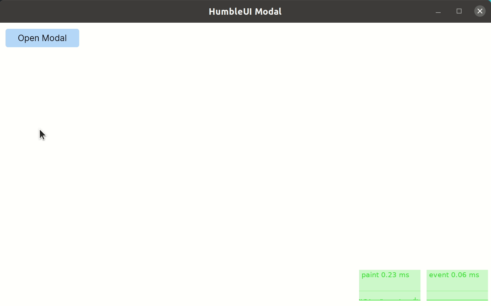

# HumbleUI Modal Example

This repo shows how to implement a simple Modal component using [HumbleUI].

[HumbleUI]:https://github.com/HumbleUI/HumbleUI

## Demo



## Development

Make sure that [Clojure v1.11.1](https://clojure.org/releases/downloads) is installed, then:

```sh
## run the program
./script/run.sh

## Run a REPL
clj -M:env/dev:repl/rebel
```

## License

[ISC License](LICENSE.md)
